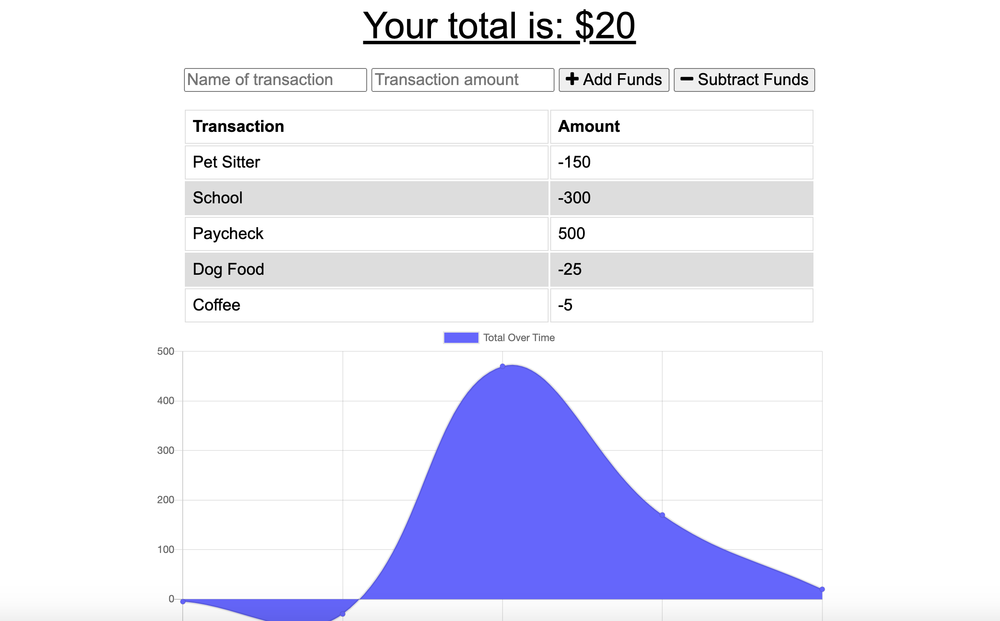

# Budget-Tracker

## Table of Contents
* [Description](#description)
* [Installation](#installation)
* [Usage](#usage)
* [License](#license)
* [Visuals](#visuals)
* [Deployed Application](#deployed)
* [Contributing](#contributing)
* [Support](#support)

## Description
Budget-Tracker is an interactive application that allows users to log and maintain their income and expenses. It incorporates offline functionalities so users can utilize this app without network access.

## Installation
This application requires the following node packages:
* Express
* Mongoose
* Morgan
* Compression
* Lite-Server

To install, run "npm install" in your Command Line System.

## Usage
Run the command "npm start" in your CLS & navigate to the specified port in your browser to access the application.

## License

## Visuals

## Deployed Application
https://frozen-coast-74141.herokuapp.com/

## Contributing
Pull requests are welcome. For major changes, please open an issue first to discuss what you would like to change. 

## Support
For questions, comments or concerns regarding the Budget-Tracker application, please email barrettpope94@gmail.com.